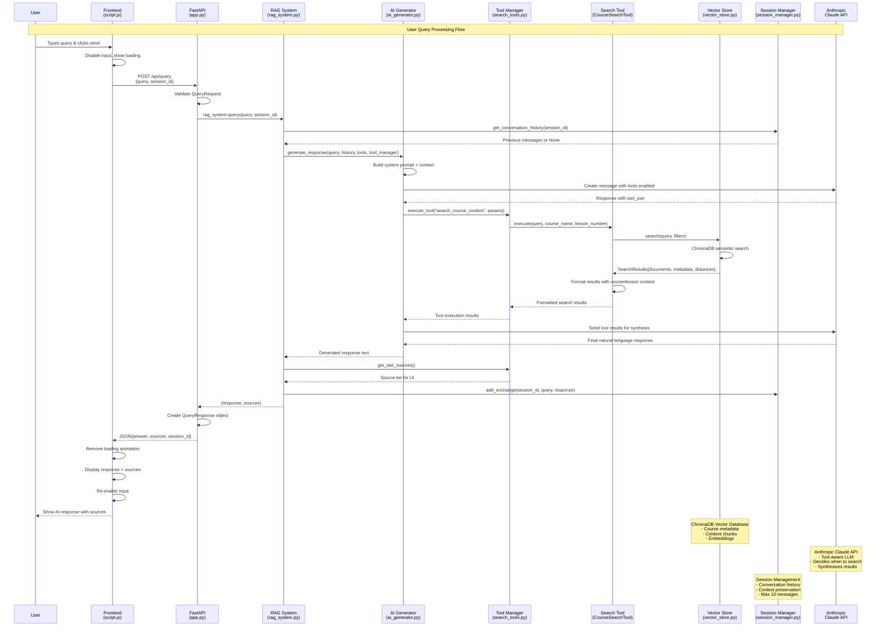

# RAG System Query Flow Diagram

## Flow Components

### **Frontend Layer**
- **User Interface**: HTML form with chat interface
- **JavaScript**: Handles events, API calls, DOM updates
- **Loading States**: Visual feedback during processing

### **API Layer** 
- **FastAPI**: REST endpoints with Pydantic validation
- **CORS**: Cross-origin request handling
- **Static Files**: Serves frontend assets

### **RAG Orchestration**
- **RAG System**: Main coordinator between components
- **Query Processing**: Formats prompts and manages flow
- **Response Assembly**: Combines AI output with sources

### **AI & Tools**
- **AI Generator**: Anthropic Claude integration
- **Tool Manager**: Registers and executes search tools
- **Search Tool**: Course-aware semantic search
- **Tool Execution**: Two-phase Claude API calls

### **Data Layer**
- **Vector Store**: ChromaDB with sentence-transformers
- **Session Manager**: Conversation history tracking
- **Document Processing**: Chunked course content

### **Key Decision Points**
1. **Tool Usage**: Claude decides when to search vs. use knowledge
2. **Search Strategy**: Course/lesson filtering based on query
3. **Context Assembly**: Combines search results with conversation history
4. **Source Tracking**: Maintains provenance for user transparency

The diagram shows how the system intelligently routes queries through semantic search when needed while maintaining conversation context and providing transparent source attribution.